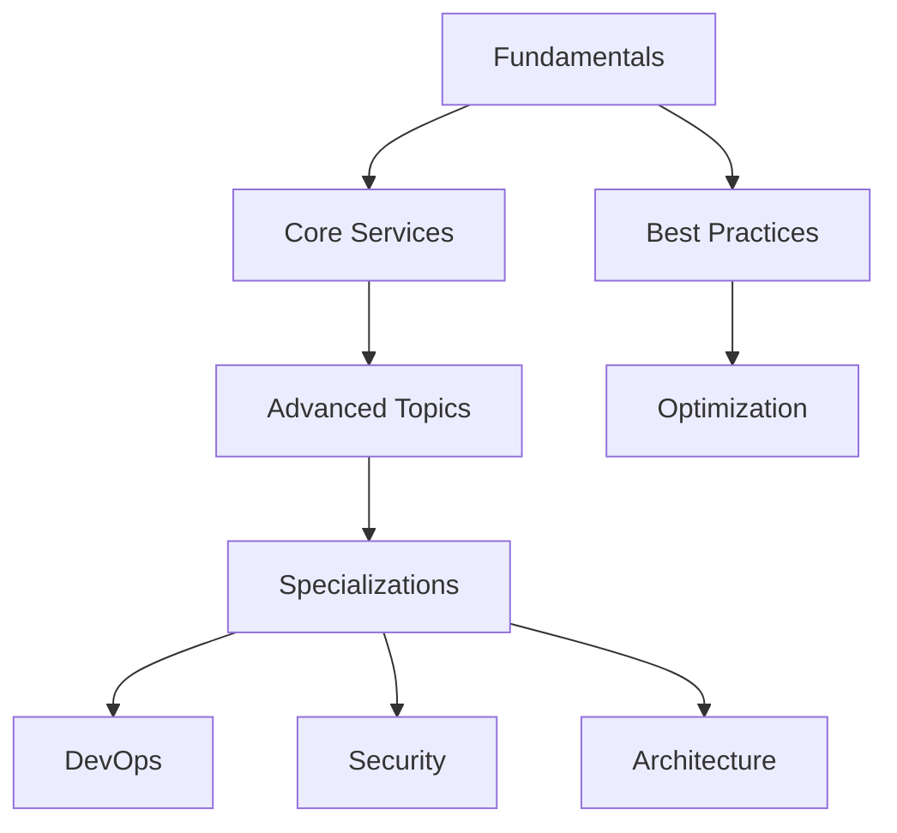
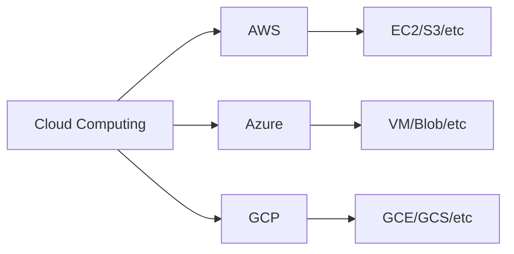
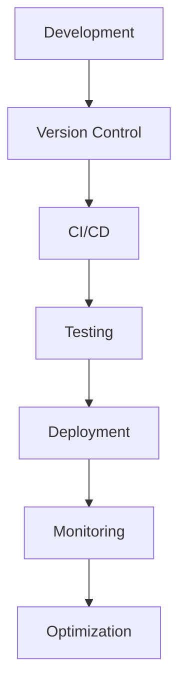
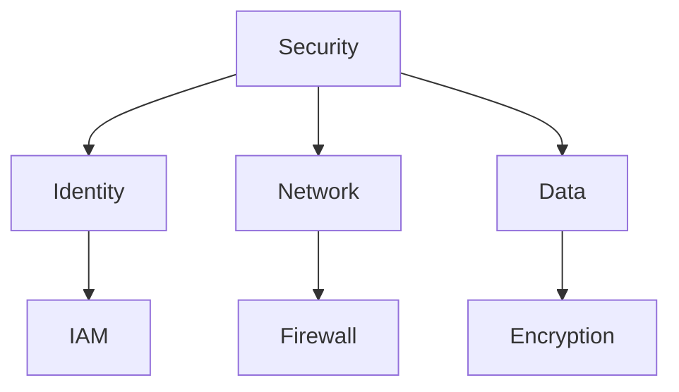

# Cloud Computing Learning Resources

A comprehensive collection of resources for learning cloud computing, focusing on major cloud platforms (AWS, Azure, GCP) and essential concepts. This repository provides structured learning paths, practical examples, and curated resources for cloud practitioners at all levels.

## ⭐ Give a Star!
If you find this repository helpful or are using it to learn cloud computing, please give it a star. Thanks!

## 📋 Table of Contents
- [Cloud Platforms](#-cloud-platforms)
  - [AWS](#amazon-web-services-aws)
  - [GCP](#google-cloud-platform-gcp)
  - [Azure](#microsoft-azure)
- [Core Concepts](#-core-concepts)
- [Advanced Topics](#-advanced-topics)
- [How to Use This Repository](#-how-to-use-this-repository)
- [Suggested Projects](#-suggested-projects)
- [Learning Resources](#-learning-resources)
- [Contributing](#-contributing)
- [License](#-license)

## ⚠️ Disclaimer
> This repository aims to provide a structured learning path for cloud computing and its ecosystem. The content is designed to guide you in understanding core concepts and practical implementation, rather than promoting specific cloud providers or services. Remember that cloud technologies evolve rapidly - always verify information and stay updated with the latest developments.

## 📊 Learning Paths

### Learning Progression

### Cloud Services

### DevOps Pipeline

### Security Framework

## 📚 Cloud Platforms

### Amazon Web Services (AWS)
- [AWS Resources](./aws/README.md)
  - Core Services
    - Compute (EC2, Lambda)
    - Storage (S3, EBS)
    - Database (RDS, DynamoDB)
    - Networking (VPC, Route53)
  - Architecture Best Practices
  - Security & Compliance
  - Cost Optimization
  - DevOps on AWS
  - [Certification Path](https://aws.amazon.com/certification/)

### Google Cloud Platform (GCP)
- [GCP Resources](./gcp/README.md)
  - Core Services
    - Compute (GCE, Cloud Functions)
    - Storage (GCS, Persistent Disk)
    - Database (Cloud SQL, Firestore)
    - Networking (VPC, Cloud DNS)
  - Cloud Architecture
  - Security & Identity
  - Cost Management
  - DevOps & SRE
  - [Certification Path](https://cloud.google.com/certification)

### Microsoft Azure
- [Azure Resources](./azure/README.md)
  - Core Services
    - Compute (VM, Functions)
    - Storage (Blob, Disk)
    - Database (SQL, Cosmos DB)
    - Networking (VNET, DNS)
  - Solution Architecture
  - Security & Identity
  - Cost Management
  - DevOps with Azure
  - [Certification Path](https://learn.microsoft.com/en-us/certifications/)

## 🚀 Core Concepts

### Cloud Fundamentals
- Cloud Service Models
  - Infrastructure as a Service (IaaS)
  - Platform as a Service (PaaS)
  - Software as a Service (SaaS)
- Deployment Models
  - Public Cloud
  - Private Cloud
  - Hybrid Cloud
  - Multi-Cloud
- Cloud Architecture Principles
  - High Availability
  - Scalability
  - Elasticity
  - Fault Tolerance
- Disaster Recovery
  - Backup Strategies
  - Recovery Plans
  - Business Continuity

### Cloud Security
- Identity & Access Management (IAM)
  - Authentication
  - Authorization
  - Role-Based Access Control
- Network Security
  - Firewalls
  - VPNs
  - Security Groups
- Data Protection
  - Encryption at Rest
  - Encryption in Transit
  - Key Management
- Compliance & Governance
  - Regulatory Requirements
  - Audit Logging
  - Policy Management

### Cloud DevOps
- Infrastructure as Code (IaC)
  - Terraform
  - CloudFormation
  - ARM Templates
- CI/CD
  - Pipeline Design
  - Automation
  - Testing Strategies
- Containerization & Orchestration
  - Docker
  - Kubernetes
  - Service Mesh
- Monitoring & Logging
  - Metrics
  - Alerts
  - Log Analysis

### Cloud Native
- Microservices Architecture
  - Design Patterns
  - Service Discovery
  - API Gateway
- Serverless Computing
  - Functions as a Service
  - Event-Driven Architecture
  - Cost Optimization
- Service Mesh
  - Traffic Management
  - Security
  - Observability

## 📚 Learning Resources

### YouTube Channels
- [AWS Online Tech Talks](https://www.youtube.com/user/AWSwebinars)
- [Google Cloud Tech](https://www.youtube.com/user/googlecloudplatform)
- [Microsoft Azure](https://www.youtube.com/user/windowsazure)
- [Cloud Guru](https://www.youtube.com/c/ACloudGuru)
- [TechWorld with Nana](https://www.youtube.com/c/TechWorldwithNana)
- [DevOps Toolkit](https://www.youtube.com/c/DevOpsToolkit)
- [That DevOps Guy](https://www.youtube.com/c/MarcelDempers)

### Blogs & Newsletters
- [AWS Architecture Blog](https://aws.amazon.com/blogs/architecture/)
- [Google Cloud Blog](https://cloud.google.com/blog/)
- [Azure Blog](https://azure.microsoft.com/en-us/blog/)
- [The New Stack](https://thenewstack.io/)
- [Cloud Native Computing Foundation](https://www.cncf.io/blog/)
- [Last Week in AWS](https://www.lastweekinaws.com/)
- [Azure Weekly](https://azureweekly.info/)

### Podcasts
- [AWS Podcast](https://aws.amazon.com/podcasts/aws-podcast/)
- [Google Cloud Platform Podcast](https://www.gcppodcast.com/)
- [Azure Friday](https://learn.microsoft.com/en-us/shows/azure-friday/)
- [Kubernetes Podcast](https://kubernetespodcast.com/)
- [The Cloud Cast](https://www.thecloudcast.net/)

### Official Documentation
- [AWS Documentation](https://docs.aws.amazon.com/)
- [Google Cloud Documentation](https://cloud.google.com/docs)
- [Azure Documentation](https://learn.microsoft.com/en-us/azure/)
- [Kubernetes Documentation](https://kubernetes.io/docs/home/)
- [Terraform Documentation](https://www.terraform.io/docs)

### Development Tools
- Cloud CLIs
  - AWS CLI
  - Google Cloud SDK
  - Azure CLI
- Infrastructure as Code
  - Terraform
  - AWS CloudFormation
  - Azure ARM Templates
- Monitoring Tools
  - CloudWatch
  - Stackdriver
  - Azure Monitor
- Development IDEs
  - VS Code with Cloud Extensions
  - Cloud9
  - IntelliJ with Cloud Plugins

## 💻 Suggested Projects
- [Practice Projects](./suggested-projects/README.md)
  - Web Applications
    - Static Website Hosting
    - Serverless API
    - Container-based App
  - Data & Analytics
    - Data Lake Setup
    - ETL Pipeline
    - Real-time Analytics
  - DevOps Projects
    - CI/CD Pipeline
    - Infrastructure as Code
    - Monitoring Setup
  - Security Projects
    - IAM Setup
    - Security Automation
    - Compliance Monitoring
  - Multi-Cloud Projects
    - Cross-cloud Backup
    - Multi-region Deployment
    - Hybrid Connectivity

## 🤝 Contributing

Feel free to contribute by:
1. Adding new resources
2. Updating existing materials
3. Fixing errors or broken links
4. Improving documentation
5. Sharing project ideas

Please read our [Contributing Guidelines](CONTRIBUTING.md) before submitting a PR.

## 📝 License

This repository is licensed under the MIT License - see the [LICENSE](LICENSE) file for details.

## 👤 Author & Maintainer

This repository is maintained by [Donnivis Baker](https://github.com/dbsectrainer). For questions or feedback, please open an issue or reach out directly.

---
Last Updated: February 2025
